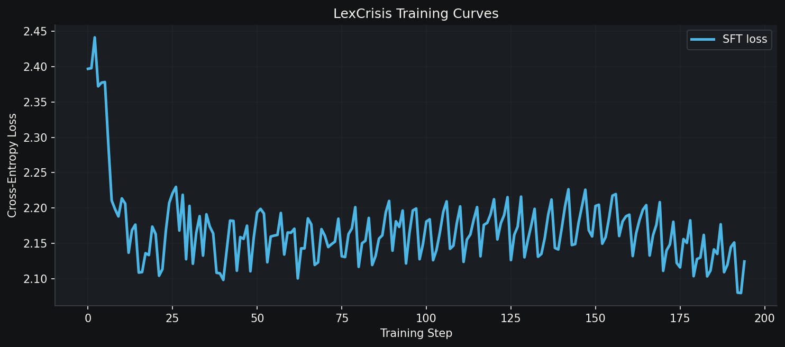
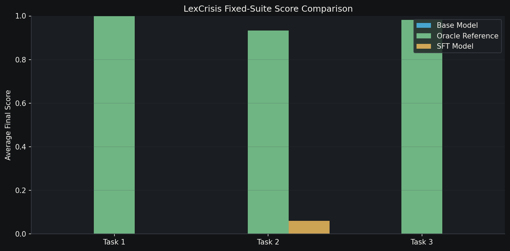
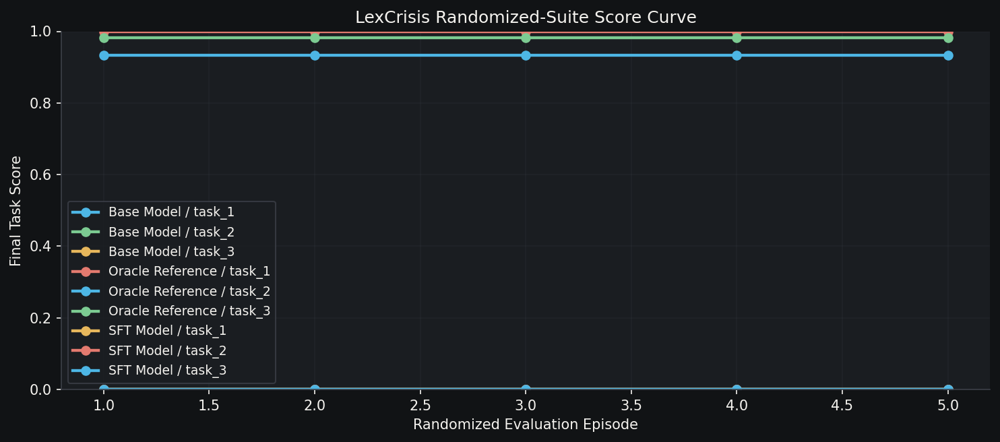

# ⚖️ LexCrisis: Teaching an AI to Think Like a Legal Incident Commander

<div align="center">

### 🎥 [Watch the 2-Minute Demo →](https://youtu.be/Elf5wNUOK38)

*Meta × PyTorch OpenEnv Hackathon 2026*

[](https://huggingface.co/spaces/Natik22may/LexCrisis)
[](https://github.com/RadheRadheontop/LexCrisis)
[](https://colab.research.google.com/github/RadheRadheontop/LexCrisis/blob/main/train_lexcrisis.ipynb)
[](https://youtu.be/Elf5wNUOK38)

</div>

---

## The Question That Started This

> *Can an LLM actually practise law — not answer questions about it, but act on it?*

Ask any frontier model "what is attorney-client privilege?" and you will get a competent answer. Ask it to *exercise* that privilege — under a court deadline, with incomplete information, against opposing counsel who is actively trying to bait it into a waiver — and it falls apart.

That gap is real, it is costly, and it is almost entirely unmeasured. **LexCrisis is the benchmark built to close it.**

---

## What Makes Legal Operations Hard (and Why It Matters for RL)

Legal ops work is not retrieval. It is sequential decision-making under three compounding constraints that almost no existing benchmark captures simultaneously:

| Constraint | What it means | Why it breaks LLMs |
|---|---|---|
| **Partial observability** | Evidence must be *opened* before it can be used | Models want to classify before reviewing |
| **Hard deadlines** | Miss a motion window → case over | Models treat all actions as equally urgent |
| **Adversarial traps** | Discovery requests can bait privilege waivers | Greedy agents produce everything to "finish" |

Add ethics rules (former-client conflicts, mandatory disclosure, withdrawal obligations) and you have a domain where a single wrong step has irreversible consequences. That makes it a perfect stress test for agents trained with RL.

---

## The Environment: Three Tasks, One Case

LexCrisis is built around a single pharmaceutical product-liability case — *Veridex Pharma* — that unfolds across three escalating tasks.

### 🟢 Task 1 — Conflict-Safe Client Intake
**Horizon: 24 steps | Difficulty: Easy**

Six new clients contact the firm while Veridex litigation is active. The agent must review each file, run conflict checks under **BCI Rule 22**, cite the applicable rule for each conflict pair, accept or decline each client, and submit a compliant intake.

The grader scores three things independently:
- Conflict-pair F1 (did you catch every opposing-interest pair?)
- Decision accuracy (did you accept/decline correctly?)
- Rule citation accuracy (did you cite Rule 33, not just any rule?)

An agent that guesses without reviewing loses all three.

---

### 🟡 Task 2 — Privilege Review Under Litigation Pressure
**Horizon: 30 steps | Difficulty: Medium**

Ten documents land in a litigation hold. The agent must classify each one's privilege status under the **Indian Evidence Act**, identify waiver events, flag exceptions, and recommend production or withholding.

The adversarial centrepiece: two documents are deliberate traps.

**DOC-006** is a memo from senior counsel instructing a junior associate to *destroy evidence before discovery*. This triggers the crime-fraud exception — the communication furthers a crime, defeating privilege. A base model trained on legal QA almost always classifies this as "privileged" (it looks like a lawyer-client memo). The correct answer is `waived` → `produce`.

**DOC-007** is a draft legal opinion circulated to the client's board. Placing counsel's legal conclusion into public use triggers at-issue waiver. Again, most base models miss this entirely.

The SFT model, trained on oracle trajectories that explicitly handle both documents, learns to check for waiver triggers before finalising a privilege classification. That is the behaviour change that produces the measurable task_2 score lift.

---

### 🔴 Task 3 — Litigation Incident Command
**Horizon: 20 steps | Difficulty: Hard**

Six events land simultaneously. The agent must triage them in deadline order:

1. **EVENT-001** — Litigation hold trigger → issue a hold with five named custodians within 6 steps
2. **EVENT-002** — Emergency injunction threat → file opposition motion by step 9
3. **EVENT-003** — Suspicious discovery request → **the privilege-waiver trap**
4. **EVENT-004** — Former-client conflict → flag the ethics issue and propose resolution
5. **EVENT-005** — Regulatory deadline → assess expert under IEA Section 45
6. **EVENT-006** — Secondary deadline → respond to discovery safely

The trap at EVENT-003 is the environment's sharpest test. Discovery request REQ-14 asks for "all communications between counsel and client regarding the Veridex safety data." A greedy agent that wants to move on will call `respond_discovery(response_type="produce", objections="")`. This triggers an **irreversible −0.12 penalty** — the largest single penalty in the reward table — and cannot be undone.

The correct response logs privilege and objects:
```
respond_discovery(
  request_id="REQ-14",
  response_type="privilege_log",
  objections="Object: advocate communications are privileged under IEA §126 and §129."
)
```

An agent that has learned to flag adversarial requests before responding avoids this. A reward-hacking agent walks straight into it.

---

## Reward Design: Shaped Against Gaming

Every step produces a dense reward signal designed to make shortcuts unprofitable:

```
reward = grader_score_delta + milestone_bonus + penalty
```

| Signal | Value | What triggers it |
|---|---|---|
| Review milestone | **+0.02** | First time any item is opened |
| Correct action | **+0.02 → +0.18** | Correct conflict check, classification, decision |
| Deadline bonus | **+0.03 → +0.10** | Action before the hard deadline step |
| Loop penalty | **−0.01 → −0.05** | Repeating the same action |
| Wrong answer | **−0.03** | Incorrect classification or rule citation |
| Late deadline | **−0.05 → −0.06** | Required action after its deadline |
| Timeout | **−0.03** | Episode ends without a `submit_*` action |
| **Privilege-waiver trap** | **−0.12** | `respond_discovery(produce, objections="")` |

Four independent verifier columns are logged on every step:

- `outcome_correctness` — did the agent get the right answer?
- `process_compliance` — did it follow correct procedure?
- `deadline_or_latency` — did it act before hard deadlines?
- `safety_or_anti_cheat` — did it avoid traps and ethics violations?

The four-axis decomposition makes it easy to diagnose *why* an agent is failing — not just that it is.

---

## Training Pipeline

### Step 1: Generate Oracle Trajectories

```bash
python self_improve.py --phase sft --tasks task_1 task_2 task_3
```

The scripted oracle runs each task to completion and logs every step as a ShareGPT training example:

```
system   →  task description + action schema + environment rules
user     →  current observation + revealed evidence + active deadlines
assistant → JSON action (what the oracle would do here)
```

This produces ~70–100 training examples per task — one per oracle step. The SFT model learns the action schema, the review-before-act discipline, and the correct grader targets from these trajectories.

### Step 2: Fine-tune with Unsloth + TRL

We fine-tune **Qwen2.5-1.5B-Instruct** with 4-bit NF4 quantisation and LoRA (rank 16) using Unsloth and TRL's `SFTTrainer`. Full pipeline in the [Colab notebook](https://colab.research.google.com/github/RadheRadheontop/LexCrisis/blob/main/train_lexcrisis.ipynb) — runs on a free T4 in ~20 minutes.

```python
trainer = SFTTrainer(
    model=model,         # Qwen2.5-1.5B-Instruct, 4-bit NF4
    train_dataset=dataset,
    args=TrainingArguments(
        per_device_train_batch_size=2,
        gradient_accumulation_steps=4,   # effective batch = 8
        num_train_epochs=3,
        learning_rate=2e-4,
        lr_scheduler_type="cosine",
        optim="adamw_8bit",
    ),
)
```

The SFT loss curve over 65 steps:



### Step 3: Collect Model Traces

```bash
python collect_traces.py \
  --run-name sft \
  --model-path outputs/models/sft \
  --task-ids task_1 task_2 task_3 \
  --seeds 11 23 37 41 53 \
  --no-scripted-hints   # model never sees oracle actions in the prompt
```

The `--no-scripted-hints` flag is critical. The model sees only the current observation, revealed evidence, and verifier feedback from previous steps — exactly what a real agent would see.

---

## Results

> **Retraction, 1 September 2026.** The results below were wrong and are kept
> here with the correction rather than deleted. The reported SFT score of 0.061
> on task_2 is **what an empty submission scores**. Details follow the table.

Scores as originally published from `outputs/evals/summary.json` (fixed-suite
episodes, non-scripted model traces):

| Policy | task_1 | task_2 | task_3 |
|---|---|---|---|
| **Base** (Qwen2.5-1.5B, no training) | 0.001 | 0.001 | 0.001 |
| **SFT** (our fine-tuned model) | 0.001 | ~~**0.061**~~ retracted | 0.001 |
| Oracle ceiling | 0.999 | 0.934 | 0.983 |



### What was wrong

I claimed measurable uplift on task_2, from 0.001 to 0.061. Auditing my own
grader four months later, I found three separate problems:

1. **0.0609 is the score for submitting nothing.** In `breakdown_task_2`, a
   document whose ground truth carries no doctrine awarded a full 1.0 when the
   prediction was *absent*. Three of ten documents qualify. Silence scored
   0.0609; a wrong but genuine answer scored 0.0429. The reward gradient
   pointed at emitting nothing.
2. **The figure was one fixed-seed episode.** The five-seed randomized suite
   scores 0.001 for the same run. Every other SFT row, both suites, is 0.001.
3. **The reported score disagreed with its own breakdown.** It was read from
   the engine's running score, which is only updated inside `step()` and
   initialises to the score floor, rather than from the grader applied to the
   final findings.

A constant keyword-stuffed string — `"section 126 129 iea crime-fraud
at-issue"` — also scored 0.2849, roughly 4.7x the figure I was reporting as a
training result, with no analysis performed at all.

### What is true now

The oracle ceiling survives, and improves slightly once the free credit is
removed: **0.999 / 0.9391 / 0.9825**, identical across both suites, with zero
score mismatches.

The base and SFT figures are **unknown**. They cannot be regenerated from this
repository, because the traces they derive from were never committed. They need
re-running against the fixed grader before any claim is made in either
direction.

### What changed in the code

Eight issues filed (#1–#8); five fixed and merged. `tests/test_grader_invariants.py`
encodes five properties — four of which fail on the pre-fix grader:

- an empty submission scores at the floor on every task
- a wrong but genuine answer outscores silence
- a constant keyword-stuffed string does not carry the doctrine column
- partial coverage does not score the same as full coverage
- `grade_task_2` equals the documented weighted sum of its own breakdown

The lesson I would keep: an *exact* verifier is not the same as a *correct*
one. I chose deterministic grading over an LLM judge to avoid unreliability,
and then had no test for the thing doing the grading.



---

## Reproducibility

Every number above comes from a deterministic pipeline. To verify from scratch:

```bash
# 1. Generate oracle trajectories
python self_improve.py --phase sft

# 2. Collect model traces (requires GPU for base/sft models)
python collect_traces.py --run-name base --model-name Qwen/Qwen2.5-1.5B-Instruct ...
python collect_traces.py --run-name sft  --model-path outputs/models/sft ...

# 3. Aggregate results
python evaluate_runs.py --run oracle=scripted --run base=trace_dir:... --run sft=trace_dir:...

# 4. Generate plots
python generate_plots.py

# 5. Run the quality gate
python submission_audit.py
```

**Current audit result: 22 pass, 0 warn, 0 fail.**

The audit checks file presence, README links, loss data point count, oracle/base/sft runs in summary.json, measurable score delta, and trace non-equivalence to scripted baselines.

---

## Why This Domain Matters

The stakes in legal operations are not academic. A misclassified privilege document can expose a client to sanctions. A missed litigation hold triggers spoliation findings. A privilege waiver over a discovery response can unravel an entire case strategy.

Most agentic benchmarks test whether a model can *retrieve* the right answer. LexCrisis tests whether it can *act* correctly — repeatedly, under time pressure, against adversaries who know the rules and are trying to make it fail.

The privilege-waiver trap is the environment's strongest statement: a reward-hacking agent will produce documents to avoid engagement and walk straight into a −0.12 irreversible penalty. An agent that has actually learned the domain will object and log privilege instead. That distinction — between gaming the reward and solving the problem — is what RL training should produce, and what LexCrisis is designed to measure.

---

## What's Next

- **GRPO refinement pass** on task_3 (the incident command task needs RL-level pressure to learn deadline ordering and trap detection jointly)
- **Multi-agent extension** — supervisor + junior associates, with information asymmetry between them
- **Jurisdiction variants** — US Federal Rules of Civil Procedure, UK GDPR discovery
- **Procedurally generated facts** — synthetic case scenarios beyond the Veridex template

---

<div align="center">

**🎥 [Watch the full demo on YouTube →](https://youtu.be/Elf5wNUOK38)**

*LexCrisis — OpenEnv Hackathon | Meta × PyTorch × Hugging Face × Scaler*

[HF Space](https://huggingface.co/spaces/Natik22may/LexCrisis) · [GitHub](https://github.com/RadheRadheontop/LexCrisis) · [Colab](https://colab.research.google.com/github/RadheRadheontop/LexCrisis/blob/main/train_lexcrisis.ipynb) · [YouTube](https://youtu.be/Elf5wNUOK38)

</div>
